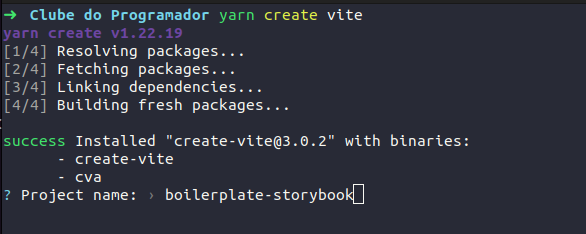
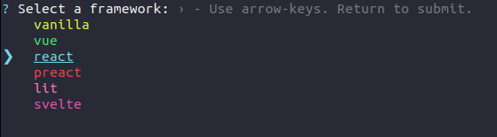
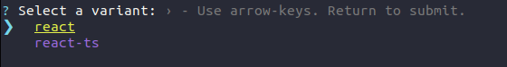
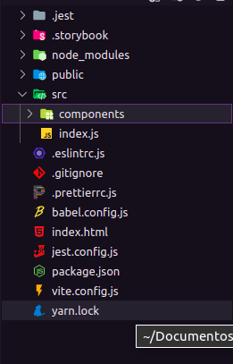
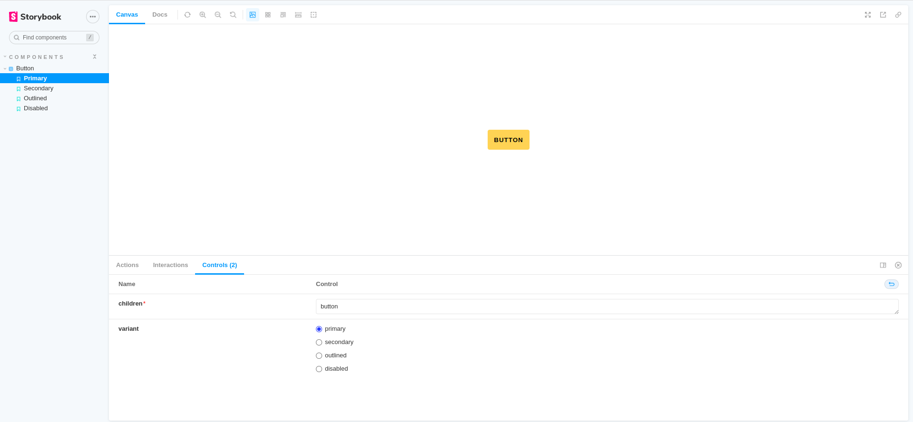

# Boilerplate Storybook com Vite

## PASSO 1: Instalar o Vite

Vite é uma ferramenta de construção que visa fornecer uma experiência de
desenvolvimento mais rápida e enxuta para projetos web modernos.

Utilizando o Yarn

```shell
  yarn create vite
```

Utilizando o NPM

```shell
  npm create vite@latest
```

- Selecione o nome do projeto.



- Selecione o framework que irá usar para o projeto no nosso caso será reactJS.



- Selecione qual você tem preferência em utilizar o JavaScript ou TypeScript
  (Nesse boilerplate estamos usando o JS)



Pronto! Seu projeto com o Vite já foi criado, basta você acessar a pasta do
projeto e executar.

```shell
cd boilerplate-storybook

yarn

yarn dev
```

## PASSO 2: Instalar dependências (Eslint, Prettier, Babel, etc)

### Instalando as dependências do Eslint

---

ESLint é uma ferramenta para identificar e relatar padrões encontrados no código
ECMAScript/JavaScript, com o objetivo de tornar o código mais consistente e
evitar bugs.

```shell
yarn add -D eslint eslint-config-prettier eslint-plugin-prettier eslint-plugin-react eslint-plugin-react-hooks eslint-plugin-storybook
```

- Crie o arquivo .eslintrc.js na raiz do projeto com o a configuração que
  recomendamos:

```JavaScript
module.exports = {
  env: {
    browser: true,
    es2021: true,
    jest: true,
    node: true,
  },
  extends: [
    'eslint:recommended',
    'plugin:react/recommended',
    'plugin:react-hooks/recommended',
    'plugin:prettier/recommended',
    'plugin:storybook/recommended',
  ],
  globals: {
    Atomics: 'readonly',
    SharedArrayBuffer: 'readonly',
  },
  parser: '@babel/eslint-parser',
  parserOptions: {
    ecmaFeatures: {
      jsx: true,
    },
    ecmaVersion: 'latest',
    sourceType: 'module',
  },
  plugins: ['react', 'prettier', 'react-hooks'],
  settings: {
    react: {
      version: 'detect',
    },
  },
  rules: {
    'react/react-in-jsx-scope': 'off',
  },
};
```

### Instalando as dependências do Babel

Babel é um compilador JS que é usado principalmente para converter o código
ECMAScript 2015+ em uma versão compatível com versões anteriores do JavaScript
em navegadores ou ambientes atuais e mais antigos.

---

```shell
yarn add -D babel-jest babel-loader @babel/core @babel/eslint-parser @babel/preset-env @babel/preset-react
```

- Crie o arquivo babel.config.js na raiz do projeto com o a configuração que
  recomendamos:

```JavaScript
module.exports = {
  presets: [
    '@babel/preset-env',
    ['@babel/preset-react', { runtime: 'automatic' }],
  ],
};
```

### Instalando as dependências do Prettier

Prettier é um formatador de código opinativo

```shell
yarn add -D prettier
```

- Crie o arquivo .prettierrc.js na raiz do projeto com o a configuração que
  recomendamos:

```JavaScript
module.exports = {
  arrowParens: 'always',
  bracketSpacing: true,
  endOfLine: 'lf',
  htmlWhitespaceSensitivity: 'ignore',
  insertPragma: false,
  jsxSingleQuote: false,
  printWidth: 80,
  proseWrap: 'always',
  quoteProps: 'as-needed',
  requirePragma: false,
  semi: true,
  singleQuote: true,
  tabWidth: 2,
  trailingComma: 'all',
  useTabs: false,
  vueIndentScriptAndStyle: false,
  embeddedLanguageFormatting: 'off',
};
```

### Instalando as dependências do Jest

Jest é um Framework de Testes em JavaScript

```shell
yarn add -D @types/jest @testing-library/jest-dom @testing-library/react jest jest-environment-jsdom identity-obj-proxy
```

Adicione a seguinte seção ao seu package.json:

```JSON
{
  "scripts": {
    "test": "jest"
  }
}
```

Crie a past .jest e adicione o arquivo setup-tests.js com:

```JavaScript
import '@testing-library/jest-dom';
```

- Crie o arquivo jest.config.js na raiz do projeto com o a configuração que
  recomendamos:

```JavaScript
module.exports = {
  coverageDirectory: 'coverage',
  collectCoverage: false,
  collectCoverageFrom: [
    'src/**/*.{js,jsx,ts,tsx}',
    '!<rootDir>/src/**/*mock*.{js,jsx,ts,tsx}',
    '!<rootDir>/src/styles/**/*.{js,jsx,ts,tsx}',
    '!<rootDir>/src/config/**/*.{js,jsx,ts,tsx}',
    '!<rootDir>/src/pages/**/*.{js,jsx,ts,tsx}',
    '!<rootDir>/**/stories.{js,jsx,ts,tsx}',
    '!<rootDir>/node_modules/',
  ],
  testEnvironment: 'jsdom',
  testMatch: [
    '**/__tests__/**/*.[jt]s?(x)',
    '**/?(*.)+(spec|test|tests).[tj]s?(x)',
  ],
  testPathIgnorePatterns: ['/node_modules/', '/.next/', '/.out/', '/public/'],
  setupFilesAfterEnv: ['<rootDir>/.jest/setup-tests.js'],
  moduleNameMapper: {
    '\\.(css|sass)$': 'identity-obj-proxy',
  },
  // transform: {
  //   // '\\.tsx?$': 'ts-jest',
  //   '\\.jsx?$': 'babel-jest',
  // },
};
```

Ou você pode inicializar as configurações através do comando global "jest":

```shell
jest --init
```

### Instalando as dependências do Storybook

Storybook é uma ferramenta para desenvolvimento de interface do usuário. Torna o
desenvolvimento mais rápido e fácil isolando componentes. Isso permite que você
trabalhe em um componente de cada vez. Você pode desenvolver UIs inteiras sem
precisar iniciar uma pilha de desenvolvimento complexa, forçar determinados
dados em seu banco de dados ou navegar em seu aplicativo.

```shell
yarn add -D @storybook/addon-actions @storybook/addon-controls @storybook/addon-essentials @storybook/addon-interactions @storybook/addon-links @storybook/builder-vite @storybook/react @storybook/testing-library
```

Adicione a seguinte seção ao seu package.json:

```JSON
{
  "scripts": {
    "storybook": "start-storybook -p 6006",
    "build-storybook": "build-storybook"
  }
}
```

Crie a pasta .storybook na raiz do projeto, adicione os arquivos:

main.js:

```JavaScript
module.exports = {
  stories: ['../src/**/*.stories.mdx', '../src/**/*.stories.@(js|jsx|ts|tsx)'],
  addons: [
    '@storybook/addon-links',
    '@storybook/addon-essentials',
    '@storybook/addon-interactions',
    '@storybook/addon-controls',
  ],
  framework: '@storybook/react',
  core: {
    builder: '@storybook/builder-vite',
  },
  features: {
    storyStoreV7: true,
  },
};
```

preview-head.html:

```html
<script>
  window.global = window;
</script>
```

reset.css:

```css
* {
  box-sizing: border-box;
}

html,
body {
  height: 100%;
}

html,
body,
#root {
  margin: 0;
  padding: 0 !important;
  width: 100%;
  min-height: 100%;
  display: flex;
  justify-content: center;
  align-items: center;
}
```

preview.js:

```JavaScript
import './reset.css';

export const parameters = {
  actions: { argTypesRegex: '^on[A-Z].*' },
  backgrounds: {
    default: 'light',
    values: [
      { name: 'light', value: '#fff' },
      { name: 'dark', value: '#000' },
    ],
  },

  controls: {
    matchers: {
      color: /(background|color)$/i,
      date: /Date$/,
    },
  },
};
```

### Instalando as dependências do react /storybook

```shell
yarn add -D @types/react @types/react-dom typescript
```

```shell
yarn add clsx prop-types
```

## PASSO 3: Construindo a estrutura do storybook

> Abra seu arquivo package.json e apague as seguintes linhas:

```Json
{
  ...
  "type": "module",
  ...
  "scripts":{
    ...
    "dev": "vite",
    "build": "vite build",
    "preview": "vite preview",
    ...
  }
}
```

> Apague todos os arquivos da pasta src e crie uma pasta components e um arquivo
> index.js:



> Dentro da pasta components crie uma pasta com o nome do nosso primeiro
> componente, como exemplo vamos colocar Button. Dentro da pasta Button vamos
> criar os seguintes arquivos seguindo a estrutura de pasta abaixo:

```shell
  .
  └── Button
      ├── Button.css
      ├── Button.jsx
      ├── Button.spec.jsx
      ├── Button.stories.jsx
      └── index.js
```

Adicione os seguintes códigos nos arquivos:

Button.css:

```css
button {
  padding: 1em;
  border-style: none;
  border-radius: 4px;
  cursor: pointer;

  font-weight: bold;
  text-transform: uppercase;
  letter-spacing: 1px;
  font-family: 'Trebuchet MS', 'Lucida Sans Unicode', 'Lucida Grande',
    'Lucida Sans', Arial, sans-serif;
}

button.--primary {
  background: #fc5;
  color: black;
}

button.--primary:hover {
  background: #fb5;
  color: black;
}

button.--secondary {
  background: #fff5e6;
  color: #fc5;
}

button.--secondary:hover {
  background: #ffebcc;
  color: #fb5;
}

button.--outlined {
  background: transparent;
  border: 3px solid #fc5;
  color: #fc5;
}

button.--outlined:hover {
  border: 3px solid #fb5;
  color: #fb5;
}

button.--disabled {
  background: #ddd;
  color: #999;
}
```

Button.jsx:

```JavaScript
import React from 'react';
import './Button.css';

import P from 'prop-types';

import clsx from 'clsx';

export const Button = ({ children, variant = 'primary' }) => {
  return (
    <button
      className={clsx('button', {
        '--primary': variant === 'primary',
        '--secondary': variant === 'secondary',
        '--outlined': variant === 'outlined',
        '--disabled': variant === 'disabled',
      })}
    >
      {children}
    </button>
  );
};

Button.propTypes = {
  children: P.string.isRequired,
  variant: P.oneOf(['primary', 'secondary', 'outlined', 'disabled']),
};
```

Button.spec.jsx

```JavaScript
import React from 'react';
import { render } from '@testing-library/react';
import { Button } from './Button';

test('should render component button', () => {
  const { container } = render(<Button />);
  expect(container).toBeInTheDocument();
});
```

index.js

```JavaScript
export * from './Button';
```

### Agora, para finalizar basta exportar nosso componente de botão

No **index.js** a pasta components exporta o componente de botão:

components/index.js:

```JavaScript
export * from './Button';
```

No **index.js** a pasta src exporta os components que construímos:

src/index.js:

```JavaScript
export * from './components';
```

## Finalizamos nosso boilerplate de componentes

> Agora basta executar o comando yarn storybook que teremos um resultado como
> esse:


